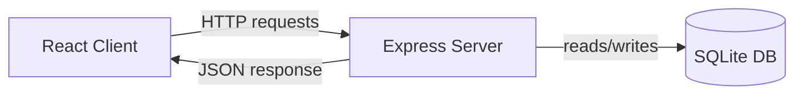

# Architecture

## Overview
A simple full-stack CRUD app: React frontend, Express backend, SQLite database.

## Components

### 1. Client (React)
- Location: `client/`
- Responsibility: Renders the item list, handles add/delete UI actions, calls backend API.
- Talks to backend via HTTP requests to `http://localhost:5000/api/items`.

### 2. Server (Express)
- Location: `server/`
- Responsibility: Exposes REST API endpoints, validates input, talks to the database.
- Endpoints:
  - `GET /api/health` — health check
  - `GET /api/items` — list all items
  - `POST /api/items` — add a new item
  - `DELETE /api/items/:id` — delete an item

### 3. Database (SQLite)
- Location: `server/db/app.db`
- Responsibility: Persists items so data survives server restarts.
- Created automatically on first server run.

### 4. Tests (Playwright)
- Location: `tests/`
- Responsibility: End-to-end tests that start client + server and verify user flows (add/view/delete item).

## Data Flow
1. User interacts with the React UI (e.g., clicks "Add").
2. Client sends an HTTP request to the Express API.
3. Express validates the request and reads/writes to SQLite.
4. Express sends a response back to the client.
5. Client updates the UI based on the response.

## Technology Choices & Rationale
- **React**: simple, component-based UI, good fit for a small CRUD app.
- **Express**: lightweight, minimal boilerplate for REST APIs.
- **SQLite**: file-based database, no separate DB server needed — ideal for a small single-user app.
- **Playwright**: covers full end-to-end flow (UI + API + DB) in one test suite.

## Diagram (Mermaid)

